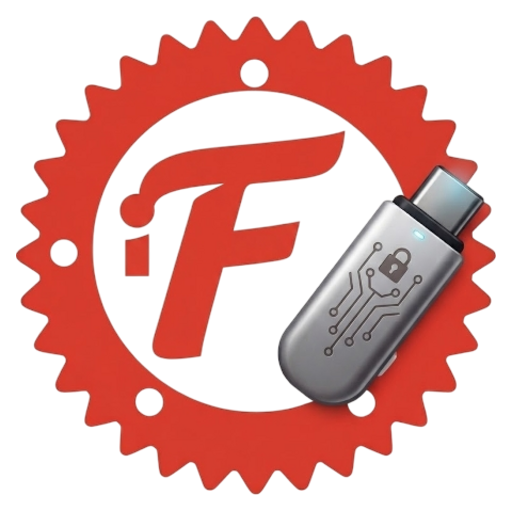

<div align="center">



# ferrix-usb

[](#)
[](LICENSE)
[](#)
[](https://crates.io/crates/ferrix-usb)

<br/>

**Offline Vetting and Verification Station for Removable Media**

*Zero-mount inspection from hardware to files.*

[Key Features](#key-features) •
[Operating Model](#operating-model) •
[Inspection Pipeline](#inspection-pipeline) •
[Universal Protection](#universal-automount-protection) •
[Installation & Usage](#installation--usage) •
[Threat Model](#threat-model-summary)

</div>

---

## Overview

Traditional endpoint security relies on antivirus software that scans files inside mounted filesystems. In air-gapped, defense, or high-assurance environments, this creates critical vulnerabilities:

- **BadUSB & Composite Attacks:** Hardware that claims to be mass storage while covertly presenting HID keyboard or network adapter interfaces.
- **Kernel Filesystem Exploits:** Malformed, hostile filesystem structures designed to trigger memory corruption or privilege escalation in kernel filesystem drivers upon mounting.
- **Partition & Layout Anomalies:** Covert data hidden in unallocated disk gaps, invalid partition ranges, or overlapping structures.
- **Egress Data Remnants:** Deleted confidential files or metadata lingering in unallocated blocks and slack space when media leaves.

**`ferrix-usb` treats the media itself as the attack surface.** Running on a dedicated offline checking station, it creates an immutable sector-by-sector snapshot, hashes every byte, parses partition tables and filesystem structures in userspace inside restricted sandboxes, and issues cryptographically signed manifests.

> **Crate Name:** `ferrix-usb` | **Installed Binary:** `ferrix`

---

## Key Features

- **Zero-Mount Inspection:** Pure userspace read-only parsers for FAT12/16/32, exFAT, NTFS, and ext2/3/4 without ever invoking the OS `mount` syscall or kernel filesystem drivers.
- **Snapshot-First Security:** Reads the physical device sequentially once into a read-only image on the station, computing a full-device BLAKE3 hash. All scans and release operations execute on the snapshot, eliminating Time-of-Check to Time-of-Use (TOCTOU) exploits.
- **BadUSB Detection:** Inspects USB descriptors and interface classes directly from sysfs before authorizing devices. Instantly flags composite devices (Mass Storage + HID keyboard/mouse).
- **Universal Automount Defense:** Enforces a 4-layer defense across the Linux kernel, ephemeral udev rules, runtime systemd masking, and desktop environment configurations (GNOME, KDE, XFCE, Cinnamon, MATE, LXQt, LXDE).
- **Release Hygiene Engine:** On `PASS`, verified files can be safely extracted to a staging folder with POSIX permission normalization (`0644`/`0755`) and sanitization of bidi overrides (RTLO), control characters, leading dashes, and Windows reserved names.
- **Landlock & Seccomp Hardening:** Drops root privileges immediately after opening device handles and enters an unprivileged sandbox with zero network access and restricted syscalls.
- **Two-Station Cryptographic Custody:** Generates Ed25519-signed manifests with BLAKE3 full-device and file hashes, replay nonces, and station signatures to verify media integrity on the receiving side.
- **Egress Sanitization & Wipe Verification:** Detects deleted file remnants in unallocated space, verifies forensic wipes (zeroed or random blocks via Shannon entropy), and flags metadata.

---

## Operating Model

```
                                  [ INGRESS FLOW ]
                                         │
 1. Physical Insertion ────────► 2. Pre-Auth Check ────────► 3. Safe Authorization
    USB device plugged in           Read sysfs descriptors       Storage-only authorized
    Kernel default: unauthorized    Flag BadUSB / composite      Block device set to read-only
                                         │
 4. Privilege Drop ────────────► 5. Snapshot & Hash ───────► 6. Deep Inspection
    Open raw block device fd        Sequential image read        Partition tables (MBR/GPT)
    Drop root -> Landlock/seccomp   Full-device BLAKE3 hash      Filesystems (FAT/NTFS/ext)
                                                                 Files (magic, macros, RTLO)
                                         │
 7. Cryptographic Manifest ◄─── 8. Verdict Evaluation ◄─── 9. Controlled Release
    Sign with station Ed25519       PASS / QUARANTINE / FAIL     PASS: Copy from snapshot
    Append to hash-chained log                                   QUARANTINE/FAIL: Lock & block
```

---

## Inspection Pipeline

| Layer | Finding Prefix | Checks Performed | Target Threats |
|---|---|---|---|
| **Device Layer** | `FX-DEV-` | USB descriptors, composite interfaces (Mass Storage + HID), vendor/product allowlist | BadUSB, Rubber Ducky, unauthorized hardware |
| **Partition Layer** | `FX-PART-` | MBR/GPT validation, protective MBR mismatch, overlapping partitions, unallocated gaps | Partition table attacks, hidden partitions, steganography |
| **Filesystem Layer** | `FX-FS-` | FAT/exFAT/NTFS/ext boot records, polyglot filesystems, cluster allocation, duplicate entries | Polyglot disks, filesystem driver exploits, structure tampering |
| **File Layer** | `FX-FILE-` | Content magic vs extension mismatch, autorun triggers, RTLO bidi overrides, zip bombs/traversal, Office macros, PDF JavaScript | Disguised executables, macro malware, archive traversal, autorun exploits |
| **Egress Layer** | `FX-EGR-` | Deleted remnants in unallocated space, Shannon entropy wipe verification, document metadata | Data leakage, incomplete media wipes, sensitive author metadata |

---

## Universal Automount Protection

To prevent the operating system from parsing untrusted data before `ferrix` inspects it, `StationProtectionGuard` automatically enforces multi-tier defense on any Linux machine:

1. **Kernel USB Core:** Sets `/sys/bus/usb/devices/usb*/authorized_default = 0` to block driver binding and block device creation on insertion.
2. **Ephemeral udev Rules:** Drops `/run/udev/rules.d/99-ferrix-no-automount.rules` (`UDISKS_AUTO="0"`, `UDISKS_IGNORE="1"`) to prevent udev, `udiskie`, and custom automounters from mounting devices.
3. **systemd Runtime Masking:** Temporarily stops and runtime-masks `udisks2` and `autofs` to prevent D-Bus auto-activation.
4. **Desktop Environment Configs:** Disables media automounting across all major desktop environments:
   - **GNOME & Budgie:** `org.gnome.desktop.media-handling` (`automount` & `automount-open`)
   - **Cinnamon:** `org.cinnamon.desktop.media-handling`
   - **MATE:** `org.mate.media-handling`
   - **XFCE / Thunar:** `thunar-volman` (`/automount-media/enabled` & `/automount-drives/enabled`)
   - **KDE Plasma 5 & 6:** `~/.config/kded5rc` and `~/.config/kded6rc` (`Module-device_automounter`)
   - **LXQt:** `pcmanfm-qt` (`Volume` settings)
   - **LXDE:** `pcmanfm.conf` (`volume` settings)

*All ephemeral udev rules, systemd masks, and desktop settings are cleanly restored when `ferrix` exits.*

---

## Installation & Usage

### Installation

Install the pre-compiled binary via `cargo`:

```bash
cargo install ferrix-usb
```

Or build from source:

```bash
git clone https://github.com/rry0ku/ferrix-usb
cd ferrix-usb
cargo build --release
sudo cp target/release/ferrix /usr/local/bin/
```

### Privileges

> **Note:** Accessing physical block devices (`/dev/sdX`) and managing sysfs USB device authorization requires elevated privileges. Run with `sudo ferrix ...` for hardware operations. `ferrix` opens necessary device handles and immediately drops privileges to an unprivileged sandbox before parsing any untrusted data.

### CLI Reference

```bash
# Launch interactive TUI (default in interactive terminal)
sudo ferrix

# Ingress scan on a physical drive or disk image
sudo ferrix scan /dev/sdb
ferrix scan /path/to/disk.raw --json

# Ingress scan with automatic file release to staging on PASS
sudo ferrix scan /dev/sdb --release --out /mnt/staging

# Egress check: verify forensic wipe and detect leftover metadata
sudo ferrix egress /dev/sdb --verify-wipe --strip-metadata

# Two-station custody verification against an Ed25519-signed manifest
sudo ferrix verify /dev/sdb --manifest ./manifest.json --pubkey station.pub

# Generate station Ed25519 signing keypair
ferrix keygen --key-dir /etc/ferrix

# Export JSON or HTML report from a previous scan
ferrix report manifest.json --html --out /var/reports/scan.html

# Review, list, or add scoped false-positive suppressions
ferrix triage --list
ferrix triage --add --hash <blake3_hex> --reason "Approved vendor diagnostic tool"
ferrix triage --add --rule FX-FILE-004 --path-pattern "*.log" --reason "Expected logs" --days 30

# Hotplug watch mode: monitor and vet newly plugged USB drives
sudo ferrix watch --auto-scan
```

### Exit Codes

| Code | Verdict | Meaning |
|---|---|---|
| `0` | **PASS** | Media passed all checks and policy rules |
| `10` | **QUARANTINE** | Suspicious findings, non-critical anomalies, or stage warnings detected |
| `20` | **FAIL** | Critical threats, BadUSB composite device, or structural violations detected |
| `1` | **ERROR** | Internal error, missing arguments, or permission denied |

---

## Policy Configuration

Security policies are defined in signed YAML files (`--policy <file>`). `ferrix` includes a strict built-in default:

```yaml
name: default-strict-ingress
allowed_filesystems:
  - fat32
  - exfat
max_partitions: 1
max_file_size_mb: 512
allowed_types:
  - pdf
  - txt
  - png
  - jpg
  - docx
archives:
  max_depth: 3
  max_expansion_ratio: 100
on_high: quarantine
on_critical: fail
```

- **Default-Deny:** Any filesystem or file type not explicitly allowlisted is blocked.
- **Content-Based:** File types are determined by detected magic bytes, never by file extensions.
- **Signed Policies:** Policies in production are verified against an Ed25519 station signature (`.sig`) before use.

---

## Threat Model Summary

### What `ferrix-usb` Stops:
- BadUSB devices that combine mass storage with HID keyboards or network interfaces.
- Hostile filesystem structures engineered to exploit kernel filesystem drivers upon mounting.
- Malicious partition tables, overlapping partitions, and data hidden in unallocated gaps.
- Executables disguised as documents, double extensions, and Unicode RTLO bidi overrides.
- Archive directory traversal attacks and decompression bombs.
- Residual confidential data in unallocated blocks and slack space.

### Honest Limits:
- **Host Controller Attacks:** Hostile devices targeting kernel USB host controller drivers during physical enumeration cannot be prevented in software. Use a dedicated, sacrificial checking station and hardware data blockers where appropriate.
- **Firmware Implants:** Implants embedded inside the drive controller microcontroller firmware are invisible to software inspection.
- **Antivirus Scanners:** `ferrix-usb` detects risky structural patterns and file anomalies, but is not a signature-based antivirus engine.

Full threat model details are in [`docs/THREAT_MODEL.md`](docs/THREAT_MODEL.md).

---

## License

`ferrix-usb` is licensed under the **GNU General Public License v3.0 or later (GPL-3.0-or-later)**. See the [LICENSE](LICENSE) file for details.
